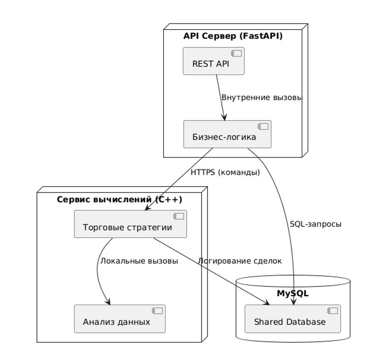
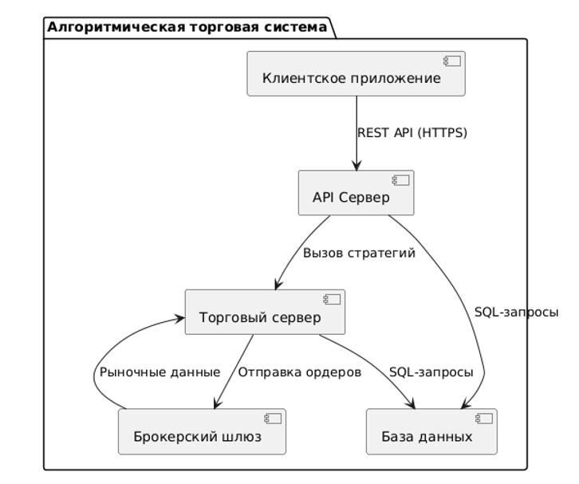

# Серверная часть информационно-аналитической системы для тестирования торговых стратегий TradeSnake


## О проекте

TradeSnake — клиентская часть системы для тестирования торговых стратегий на бирже.

Особенности:
- Тестирование на исторических и реальных данных
- Просмотр статистики портфеля ботов
- Гибкая настройка и создание ботов с готовыми стратегиями
- Обновление стратегий на серверной части
## О сервиса
 Основной сервис для авторизации и работы с базой данных.

## Используемые библиотеки

- FastAPI  
- Pydantic  
- SQLAlchemy  
- hypercorn

## Быстрый старт

```bash
git clone https://github.com/ChornyChay1/TradeSnakeBackPython.git
cd TradeBot
pip install -r requirements.txt
python TradeBot.py
```

## Особенности
В данном репозитории скрыта часть, связанная с авторизацией.
BackEnd будет неполноценным без подключения сервиса торговли на С++ [Вот тут](https://github.com/ChornyChay1/TradeSnakeBackendC) 

## Архитектура
### Диаграмма развертывания:
<p align="center">
  
</p>

### Диаграмма компонентов:
<p align="center">
  
</p>
  
## Автор и права

Артём Ковалёв © 2025  
Все права защищены.
